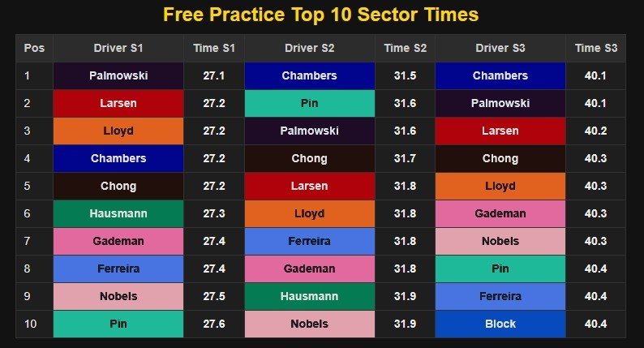
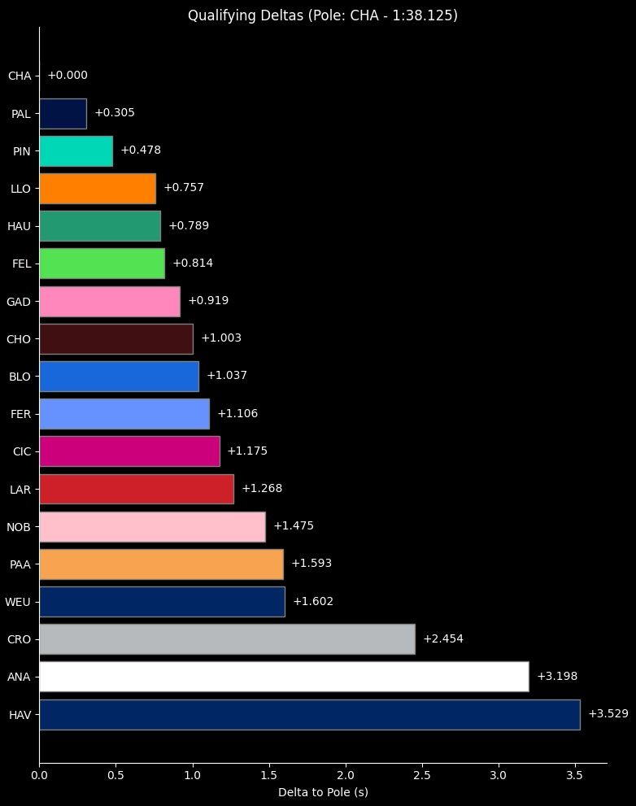
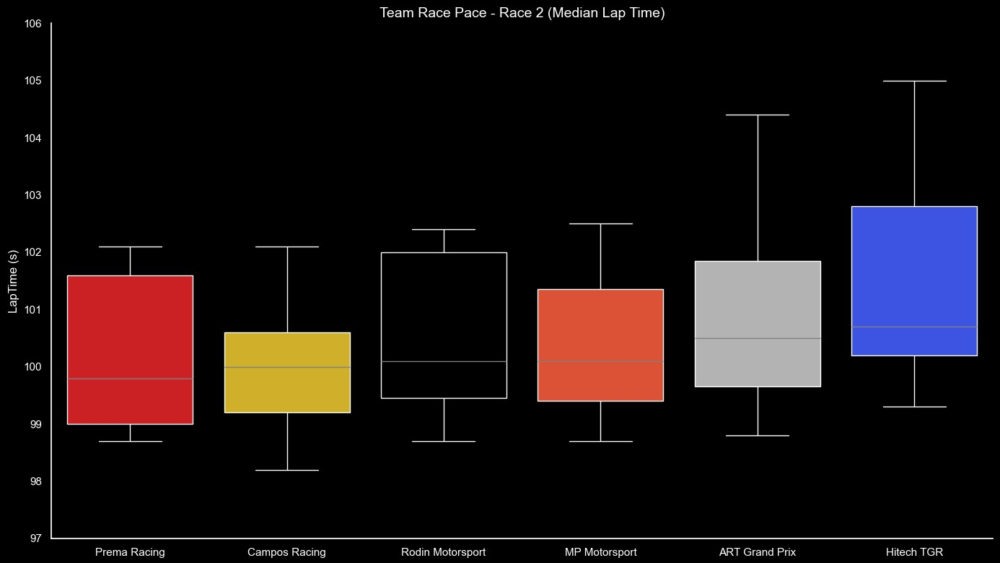

F1AcademyData - Historical Formula 1 Academy Data
======
## Repository containing Practice, Qualifying, and Race timing data from past F1 Academy race weekends.

The core purpose of the repository is provide historical practice, qualifying, and race data for the Formual 1 Academy series. This repository contains the scripts used to gather live timing data from the F1 Academy live timing page during sessions. I took a lot of inspiration from the existing FastF1 project (https://docs.fastf1.dev/index.html) and ported some of their examples over for data visualization.

Over time I also hope to grow this repository to contain examples of data visualization and insights that can be generated from the historical data such as the example below.

